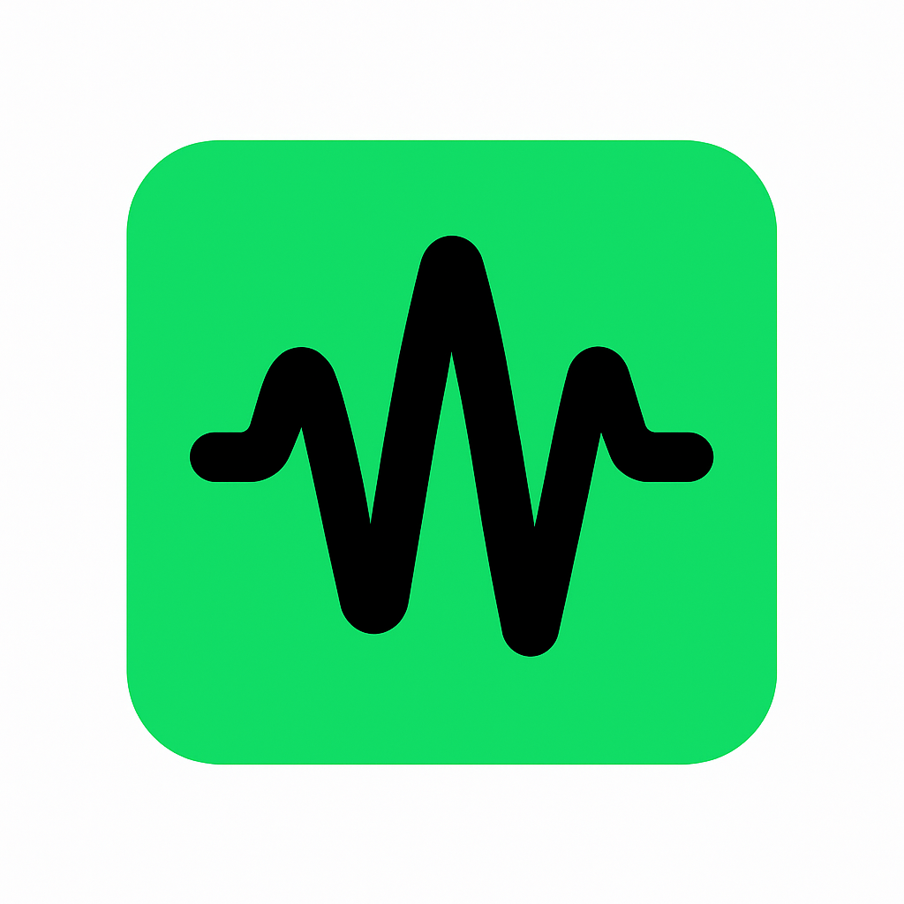

# AmbientVibe



**Modern Chrome extension that adds high-quality ambient reverb effects to web audio**

---

## 🎯 Purpose

**AmbientVibe** is an elegant and user-friendly Chrome extension that adds real-time reverb (ambiance) effects to music or videos playing on sites like YouTube, Spotify, SoundCloud, and more.

---

## 🚀 Features

- 🎚️ **Preset Selection:** Small Room, Large Room, Concert Hall, Ambient Wash, Moonlight Chamber
- 🌈 **Theme Support:** Dark (Spotify-style), Light, and Violet themes
- 🔊 **Reverb Intensity:** Adjustable effect intensity with percentage control
- 🟢 **ON/OFF Switch:** One-click activation/deactivation
- 💾 **Settings Storage:** All settings saved locally for persistence
- 🖥️ **Modern UI:** Responsive design with logo and elegant popup interface
- ⚡ **High Performance:** Optimized audio processing with professional-grade 48kHz audio context
- 🎵 **Production Quality:** Pure JavaScript implementation with high-quality impulse response

---

## 🛠️ Installation & Setup

### Prerequisites

- Google Chrome browser
- No additional software or dependencies required

### Step-by-Step Installation

1.  **Download the Extension:**

    ```sh
    git clone https://github.com/username/ambientvibe.git
    ```

    Or download as ZIP and extract to your desired location.

2.  **Verify Required Files:**
    Ensure these essential files are present:

    - `audio/large-studio-room.wav` (High-quality impulse response file)
    - `images/ambientvibe.png` (Extension icon)
    - `manifest.json` (Extension configuration)

3.  **Load in Chrome:**

    - Open Chrome and navigate to `chrome://extensions/`
    - Enable **"Developer mode"** (toggle in top right corner)
    - Click **"Load unpacked"** button
    - Select the AmbientVibe project folder
    - The extension will load and appear in your toolbar

4.  **Verify Installation:**
    - Look for the AmbientVibe icon in your Chrome toolbar
    - Click the icon to open the control popup
    - If successful, you'll see the modern interface with all controls

---

## 🎮 How to Use

### Getting Started

1. **Navigate to any audio/video website** (YouTube, Spotify, SoundCloud, etc.)
2. **Start playing music or video content**
3. **Click the AmbientVibe icon** in your Chrome toolbar
4. **The control popup will open** with all available options

### Control Interface

#### 🟢 Main Power Switch

- **ON/OFF Toggle:** Master control to enable/disable all reverb effects
- **Visual Feedback:** Interface dims when disabled
- **Instant Effect:** Changes take effect immediately

#### 🎚️ Reverb Presets

Choose from 5 carefully crafted reverb environments:

- **Small Room** (20% intensity) - Intimate, subtle reverb for close listening
- **Large Room** (40% intensity) - Medium spatial reverb for general use
- **Concert Hall** (70% intensity) - Grand, spacious reverb for classical music
- **Ambient Wash** (90% intensity) - Immersive, atmospheric reverb for ambient music
- **Moonlight Chamber** (60% intensity) - Warm, ethereal reverb for relaxing music

#### 🔊 Intensity Control

- **Fine-tune the reverb amount** with the percentage slider (0-100%)
- **Real-time adjustment** - changes apply instantly without interruption
- **Overrides preset values** when manually adjusted

#### 🌈 Theme Selection

- **Dark Theme** (Default) - Spotify-inspired dark interface
- **Light Theme** - Clean, bright interface for daytime use
- **Violet Theme** - Stylish purple gradient theme

### Testing the Extension

#### ✅ Expected Behavior

When properly working, you should experience:

- **Immediate reverb effect** when switched ON
- **Clear audio difference** between ON/OFF states
- **Distinct characteristics** when changing presets
- **Smooth intensity changes** with the slider
- **Persistent settings** that remember your preferences

#### 🔊 Audio Quality

- **No pitch changes** - only pure reverb added to original audio
- **No audio artifacts** or distortion
- **High-quality processing** at 48kHz professional sample rate
- **Smooth transitions** between settings without clicks or pops

---

## 📦 Project Structure

```
AmbientVibe/
├── manifest.json                 # Chrome extension manifest
├── audio/
│   └── large-studio-room.wav    # High-quality impulse response (264KB)
├── content-scripts/
│   └── initialize.js            # Audio processing logic (5.9KB)
├── popups/
│   └── main/
│       ├── main.html           # Extension popup interface (2.6KB)
│       ├── main.js             # Popup behavior logic (4.5KB)
│       └── main.css            # Modern styling with themes (7.6KB)
├── images/
│   └── ambientvibe.png         # Extension icon
├── README.md                   # This documentation
└── PRODUCTION_CHECKLIST.md    # Quality assurance checklist
```

---

## 🎵 Technical Specifications

### Audio Processing

- **Sample Rate:** 48kHz (professional audio standard)
- **Impulse Response:** High-quality WAV format, mono channel
- **Audio Engine:** Web Audio API with convolution reverb
- **Latency:** Optimized for playback quality over low latency
- **Effects:** Pure ambient reverb only, no pitch or other artifacts

### Browser Compatibility

- **Chrome Manifest V3** compliant
- **Modern Chrome versions** (90+)
- **Cross-platform support** (Windows, macOS, Linux)

### Performance

- **Lightweight:** Total package size 2.3MB
- **Efficient processing:** Minimal CPU impact
- **Memory optimized:** Proper resource cleanup
- **Background processing:** No interference with browsing

---

## 🛠️ Troubleshooting

### Extension Not Loading

**Problem:** Extension fails to install in Chrome

**Solutions:**

1. Ensure **Developer mode** is enabled in `chrome://extensions/`
2. Check that all required files are present in the folder
3. Verify `manifest.json` is valid (no syntax errors)
4. Try refreshing the extensions page after loading

### No Reverb Effect Heard

**Problem:** Extension loads but no audio effect is audible

**Solutions:**

1. **Check the ON/OFF switch** - ensure it's in the ON position
2. **Verify audio is playing** on the webpage first
3. **Try different presets** to test if any work
4. **Check browser console** (F12) for error messages
5. **Test on different audio sites** (YouTube, Spotify, etc.)

### Extension Popup Not Opening

**Problem:** Clicking the toolbar icon does nothing

**Solutions:**

1. **Right-click the icon** and select "Open popup"
2. **Reload the extension** in `chrome://extensions/`
3. **Check for conflicting extensions** that might interfere
4. **Restart Chrome browser** completely

### Settings Not Saving

**Problem:** Preferences reset after closing browser

**Solutions:**

1. **Check browser storage permissions**
2. **Ensure localStorage is enabled** in Chrome settings
3. **Try clearing browser cache** and reconfiguring
4. **Check if incognito mode** is being used (settings won't persist)

### Console Error Messages

**Problem:** Seeing errors in browser developer console

**Common Errors & Solutions:**

- `AudioContext suspended` → Click anywhere on the page to activate audio
- `Failed to load IR file` → Check that audio files are properly included
- `Permission denied` → Verify extension has necessary permissions

---

## 👨‍💻 Technical Implementation

### Architecture

- **Pure JavaScript:** 100% JavaScript implementation with no external dependencies
- **Modular Design:** Separated content scripts, popup logic, and styling
- **Event-Driven:** Efficient message passing between popup and content scripts
- **Error Resilient:** Comprehensive error handling throughout

### Settings Management

- **Storage Location:** All preferences saved in localStorage as `ambientVibeSettings`
- **Data Structure:** Single object containing preset, intensity, theme, and on/off state
- **Persistence:** Settings automatically restored on browser restart
- **Real-time Sync:** Changes immediately propagated to active audio processing

### Audio Pipeline

```
Audio/Video Element → Media Source → [Dry Path] → Output
                                  → [Wet Path] → Convolver → Gain → Output
```

---

## 🚀 Advanced Usage

### Custom Impulse Responses

Advanced users can replace the default impulse response:

1. Create or obtain a high-quality WAV file
2. Replace `audio/large-studio-room.wav` with your file
3. Ensure the file is mono, 44.1kHz or 48kHz sample rate
4. Reload the extension to use the new impulse response

### Integration with Music Workflows

- **For Producers:** Use while referencing tracks to hear how they sound in different spaces
- **For Listeners:** Enhance streaming music with spatial audio characteristics
- **For Content Creators:** Preview how audio content sounds in various acoustic environments

---

## 📈 Version History

### v1.0.0 (Current - Production Release)

- ✅ High-quality reverb processing at 48kHz
- ✅ Five carefully crafted preset environments
- ✅ Modern, themeable user interface
- ✅ Comprehensive error handling and logging
- ✅ Pure JavaScript implementation
- ✅ Chrome Manifest V3 compliance
- ✅ Production-ready optimization

---

## 📢 Support & Contributing

### Getting Help

- **Check this README** for common solutions
- **Open an issue** on GitHub for bug reports
- **Review console logs** for technical troubleshooting

### Contributing

Contributions are welcome! Please:

1. Fork the repository
2. Create a feature branch
3. Make your changes with appropriate testing
4. Submit a pull request with detailed description

### License

This project is distributed under the **MIT License** - feel free to use, modify, and distribute as needed.

---

## 🎵 Credits & Acknowledgments

- **Audio Processing:** Built with Web Audio API convolution reverb
- **UI Design:** Modern interface inspired by popular music applications
- **Impulse Response:** High-quality studio room acoustics

---

**AmbientVibe** &mdash; Transform your web audio experience with professional ambient reverb effects! 🎵✨
